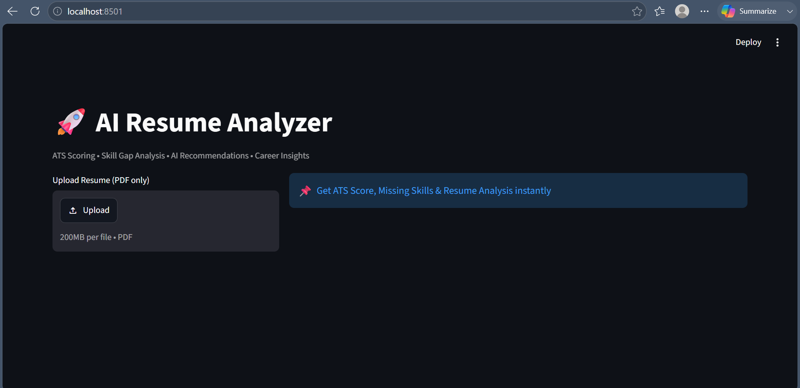
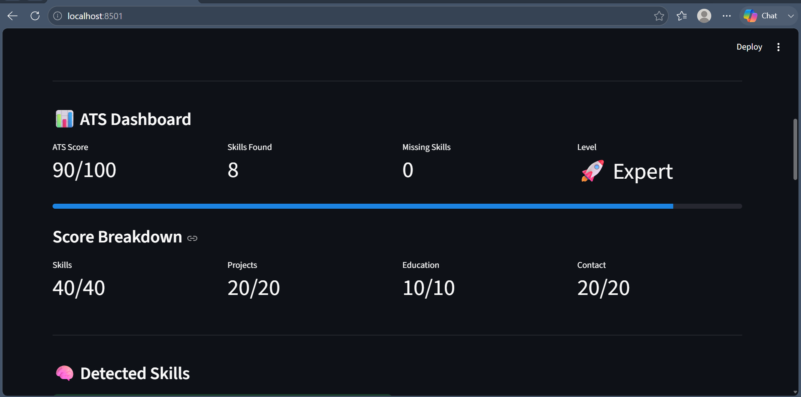

🚀 AI Resume Analyzer

An AI-powered Resume Analysis tool built using Python, Streamlit, and Google Gemini API.

This application helps users evaluate their resumes through ATS scoring, skill gap analysis, role-based recommendations, and AI-generated career suggestions.

---

📸 Project Preview

<h2>🏠 Home Page</h2>

  

<h2>📊 ATS Dashboard</h2>

  

---

✨ Features

- 📄 Upload Resume (PDF)
- 🔍 Extract Resume Content
- 🧠 Detect Technical Skills
- 📊 ATS Score Calculation
- 🏆 Resume Strength Analysis
- ❌ Missing Skills Detection
- 🎯 Role-Based Skill Gap Analysis
- 🤖 AI-Powered Suggestions using Gemini
- 📈 Interactive Charts & Dashboard
- 📥 Downloadable Resume Report

---

🛠️ Tech Stack

- Python
- Streamlit
- PDFPlumber
- Pandas
- Plotly
- Google Gemini API
- Python Dotenv

---

📂 Project Structure

AI-Resume-Analyzer/
│
├── screenshots/
│   ├── home.png
│   ├── ats_dashboard.png
│   └── ai_suggestions.png
│
├── app.py
├── ai_engine.py
├── ats_score.py
├── skill_extractor.py
├── skill_gap.py
├── role_skills.py
│
├── requirements.txt
├── README.md
├── .gitignore
└── .env

---

⚙️ Installation

1️⃣ Clone Repository

git clone <https://github.com/sakshi-chaudhary91/AI-Resume-Analyzer.git>
cd AI-Resume-Analyzer

2️⃣ Install Dependencies

pip install -r requirements.txt

3️⃣ Create Environment File

Create a ".env" file in the project root:

GEMINI_API_KEY=your_api_key_here

4️⃣ Run Application

streamlit run app.py

---

📊 Analysis Modules

ATS Dashboard

- Overall ATS Score
- Skills Score
- Projects Score
- Education Score
- Contact Score
- Resume Strength Badge

Skill Analysis

- Detected Skills
- Missing Skills
- Role-Based Missing Skills

AI Analysis

- Resume Improvement Suggestions
- Missing Technologies
- Career Recommendations

---

🎯 Supported Roles

- AI Engineer
- Data Analyst
- Frontend Developer

---

🔮 Future Improvements

- Resume vs Job Description Matching
- AI-Based ATS Scoring
- Resume Ranking System
- AI Career Roadmap Generator
- Multi-Role Analysis
- Advanced Resume Recommendations

---

👩‍💻 Author

Sakshi Chaudhary

B.Tech CSE (AI & ML)

Aspiring AI/ML & Generative AI Engineer

---

⭐ Support

If you found this project useful, consider giving it a ⭐ on GitHub.